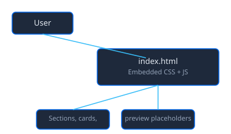

<div align="center">

# Team Play

Curated games and activities for team building, retros, and virtual meetups.

[![Live][badge-site]][url-site]
[![HTML5][badge-html]][url-html]
[![CSS3][badge-css]][url-css]
[![JavaScript][badge-js]][url-js]
[![Claude Code][badge-claude]][url-claude]
[![License][badge-license]](LICENSE)

[badge-site]:    https://img.shields.io/badge/live_site-0063e5?style=for-the-badge&logo=googlechrome&logoColor=white
[badge-html]:    https://img.shields.io/badge/HTML5-E34F26?style=for-the-badge&logo=html5&logoColor=white
[badge-css]:     https://img.shields.io/badge/CSS3-1572B6?style=for-the-badge&logo=css3&logoColor=white
[badge-js]:      https://img.shields.io/badge/JavaScript-F7DF1E?style=for-the-badge&logo=javascript&logoColor=black
[badge-claude]:  https://img.shields.io/badge/Claude_Code-CC785C?style=for-the-badge&logo=anthropic&logoColor=white
[badge-license]: https://img.shields.io/badge/license-MIT-404040?style=for-the-badge

[url-site]:   https://teamplay.neorgon.com/
[url-html]:   #
[url-css]:    #
[url-js]:     #
[url-claude]: https://claude.ai/code

</div>

---

## Overview

A single-page catalog of games, icebreakers, retro formats, and virtual meetup tools. Each resource has a preview area (screenshot or placeholder), a short description, and a link. Optional video preview slots let you embed YouTube clips for activities that have a demo or tutorial.

**Live:** teamplay.neorgon.com

---

## Features

- **Games** -- Skribbl, Gartic Phone, Quick Draw, Ice Breaker, Jeopardy Labs, Codenames, Spyfall
- **Interactions** -- Two Truths and a Lie, Show and Tell (no tool needed)
- **Activities** -- Draw a geometrical figure from instructions
- **Virtual meetups** -- Gather Town
- **Retros** -- Favorite picture, Describe sprint with a song (Gist), Personal map (Mural), DA peek from your desk
- **Random** -- Wheel of Names
- **Preview images** -- Add screenshots under `assets/previews/` to replace placeholders (see below)
- **Video previews** -- Optional YouTube embed in any card (uncomment the `resource-video` block and set the video ID)

---

## Adding preview screenshots

Place PNG or JPG files in `assets/previews/` using these filenames. If a file is missing, the card shows a "Preview" placeholder.

**Capture screenshots automatically:** use the script in `scripts/` to capture all previews (or one by slug):

```bash
cd scripts
npm install
npx playwright install chromium
npm run capture
```

Options: `npm run capture -- --one skribbl` (one slug), `npm run capture -- --wait 5000` (wait 5s after load).

| Filename | Resource |
|----------|----------|
| `skribbl.png` | Skribbl |
| `garticphone.png` | Gartic Phone |
| `quickdraw.png` | Quick Draw |
| `icebreaker.png` | Ice Breaker (Range) |
| `jeopardy.png` | Jeopardy Labs |
| `codenames.png` | Codenames |
| `spyfall.png` | Spyfall |
| `gather.png` | Gather Town |
| `mural.png` | Mural (Personal map) |
| `wheelofnames.png` | Wheel of Names |

---

## Adding video previews

In `index.html`, find the card you want and uncomment the `resource-video` block. Set the iframe `src` to your YouTube embed URL (e.g. `https://www.youtube.com/embed/VIDEO_ID?rel=0`).

---

## Running locally

Open `index.html` in a browser, or:

```bash
make serve
# or: python3 -m http.server 8821
```

---

## Architecture



```
team-play-site/
├── index.html           # Single page: sections, resource cards, preview placeholders
├── assets/
│   └── previews/        # Optional screenshots (see table above or scripts/capture)
├── scripts/             # Preview capture utility (Playwright)
│   ├── capture-previews.js
│   └── package.json
├── docs/
│   ├── architecture.mmd
│   └── architecture.svg
├── robots.txt
├── sitemap.xml
├── CNAME                # teamplay.neorgon.com
├── Makefile             # make serve (port 8821)
└── README.md
```

---

<div align="center">
<sub>Part of <a href="https://neorgon.com/">Neorgon</a></sub>
</div>
